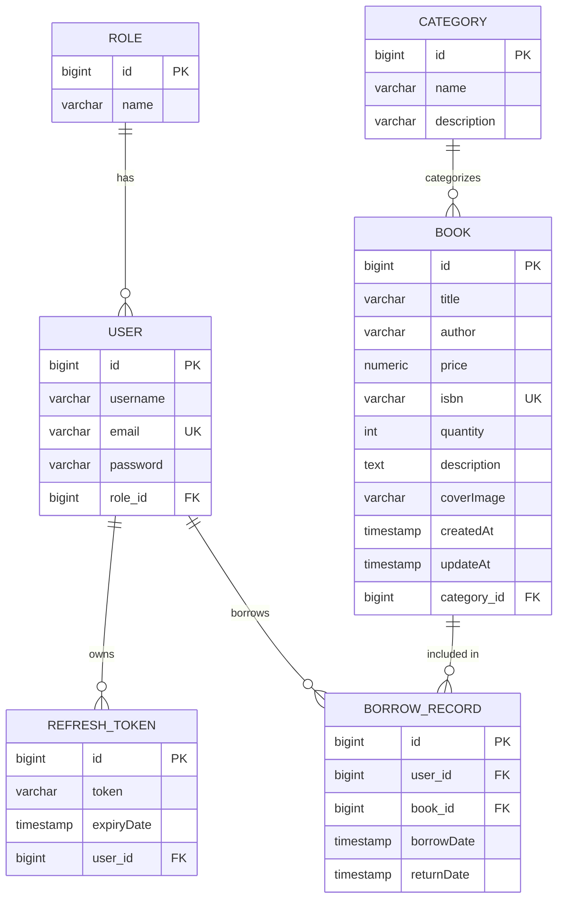

# 📚 Library Management System - Backend RESTful API

## 📖 Giới thiệu tổng quan

**Library Management System (Backend)** là hệ thống quản lý thư viện được xây dựng trên nền tảng **Spring Boot**, cung cấp bộ RESTful API toàn diện cho các hoạt động quản lý sách, danh mục, người dùng, vai trò và quy trình mượn - trả sách. 

Hệ thống tích hợp giải pháp xác thực và bảo mật không trạng thái (Stateless Security) sử dụng **Spring Security** kết hợp **JWT (JSON Web Token)** với cơ chế cặp token (Access Token & Refresh Token) và phân quyền chặt chẽ theo vai trò (Role-Based Access Control - RBAC).

---

## 🛠 Công nghệ sử dụng (Tech Stack)

- **Ngôn ngữ lập trình**: Java (JDK 21+)
- **Core Framework**: Spring Boot
  - `spring-boot-starter-webmvc`: Xây dựng RESTful API controllers
  - `spring-boot-starter-data-jpa`: Tương tác cơ sở dữ liệu thông qua Hibernate ORM
  - `spring-boot-starter-security`: Kiểm soát bảo mật, lọc request và phân quyền
  - `spring-boot-starter-validation`: Xác thực dữ liệu đầu vào (Jakarta Validation)
- **Cơ sở dữ liệu**: PostgreSQL
- **Xác thực & Bảo mật (JWT)**: `io.jsonwebtoken` (JJWT 0.12.7: jjwt-api, jjwt-impl, jjwt-jackson)
- **Mã hóa mật khẩu**: Spring Security `BCryptPasswordEncoder`
- **Build Tool & Quản lý phụ thuộc**: Maven (bao gồm Maven Wrapper `mvnw`)

---

## 🏗 Kiến trúc hệ thống

Dự án tuân thủ mô hình kiến trúc phân tầng chuẩn (**Layered Architecture**), đảm bảo nguyên tắc Clean Code và tách biệt trách nhiệm (Separation of Concerns):

```
                        [ Client Request ]
                                │
                                ▼
                   ┌──────────────────────────┐
                   │  JwtAuthenticationFilter  │ (Xác thực JWT Token & Phân quyền)
                   └────────────┬─────────────┘
                                │
                                ▼
                   ┌──────────────────────────┐
                   │     Controller Layer     │ (Tiếp nhận HTTP Request, routing, validate)
                   └────────────┬─────────────┘
                                │
                                ▼
                   ┌──────────────────────────┐
                   │      Service Layer       │ (Xử lý nghiệp vụ logic, kiểm tra quyền truy cập)
                   └────────────┬─────────────┘
                                │
                                ▼
                   ┌──────────────────────────┐
                   │     Repository Layer     │ (Giao tiếp database qua Spring Data JPA)
                   └────────────┬─────────────┘
                                │
                                ▼
                   ┌──────────────────────────┐
                   │   PostgreSQL Database    │ (Lưu trữ quan hệ: users, books, borrow_records,...)
                   └──────────────────────────┘
```

### Các tầng thành phần chính:
- **`Config`**: Cấu hình Spring Security (`SecurityConfig`), cấu hình bộ lọc xác thực `JwtAuthenticationFilter` (kiểm tra token trong header `Authorization: Bearer <token>`).
- **`Controller`**: Định nghĩa các REST endpoints, tiếp nhận request payload/params, áp dụng bảo vệ method level với `@PreAuthorize`.
- **`Service`**: Cung cấp nghiệp vụ ứng dụng: cấp phát token, xử lý mượn/trả, cập nhật trạng thái sách, băm mật khẩu, kiểm tra quyền hạn dữ liệu người dùng.
- **`Repository`**: Kế thừa `JpaRepository` thực thi các truy vấn tự động và tùy biến (e.g. tìm theo ISBN, categoryId, username, email).
- **`Entity`**: Định nghĩa bảng quan hệ JPA trong PostgreSQL.
- **`Dto`**: Cung cấp các mẫu yêu cầu/phản hồi (`ApiResponse`, `LoginRequest`, `RefreshRequest`, `AuthResponse`, `JwtAccess`) giúp che giấu cấu trúc thực thể nhạy cảm và thống nhất dữ liệu trả về.

---

## 📂 Cấu trúc thư mục mã nguồn Backend

```text
backend/book-management/book-management/
├── pom.xml                               # File cấu hình phụ thuộc Maven
├── mvnw / mvnw.cmd                       # Maven Wrapper cho Linux / Windows
└── src/
    └── main/
        ├── java/com/bookstore/book_management/
        │   ├── BookManagementApplication.java    # Điểm khởi chạy ứng dụng (Main class)
        │   ├── Config/                           # Cấu hình hệ thống & Security
        │   │   ├── JwtAuthenticationFilter.java  # Filter trích xuất và xác thực token JWT
        │   │   └── SecurityConfig.java           # Định cấu hình phân quyền HttpSecurity & Stateless Session
        │   ├── Controller/                       # Tầng Controller RESTful API
        │   │   ├── AuthController.java           # API Đăng ký, đăng nhập, refresh token, đăng xuất
        │   │   ├── BookController.java           # API Quản lý sách
        │   │   ├── CategoryController.java       # API Quản lý danh mục sách
        │   │   ├── BorrowRecordController.java   # API Quản lý phiếu mượn/trả sách
        │   │   ├── UserController.java           # API Quản lý tài khoản người dùng
        │   │   └── RoleController.java           # API Quản lý quyền/vai trò
        │   ├── Dto/                              # Đối tượng trao đổi dữ liệu (Data Transfer Objects)
        │   │   ├── ApiResponse.java              # Định dạng phản hồi API chuẩn hóa
        │   │   ├── AuthResponse.java             # Payload chứa Access Token & Refresh Token
        │   │   ├── JwtAccess.java                # Principal lưu trữ thông tin user sau khi giải mã JWT
        │   │   ├── LoginRequest.java             # DTO đăng nhập (email, password)
        │   │   └── RefreshRequest.java           # DTO làm mới token (refreshToken)
        │   ├── Entity/                           # Các thực thể JPA Entity (ORM)
        │   │   ├── Book.java                     # Sách trong thư viện
        │   │   ├── Category.java                 # Thể loại sách
        │   │   ├── BorrowRecord.java             # Phiếu mượn/trả sách
        │   │   ├── User.java                     # Người dùng hệ thống
        │   │   ├── Role.java                     # Vai trò (ADMIN, USER)
        │   │   └── RefreshToken.java             # Quản lý phiên và hạn dùng Refresh Token trong DB
        │   ├── Repository/                       # Tầng JPA Repositories
        │   │   ├── BookRepository.java
        │   │   ├── CategoryRepository.java
        │   │   ├── BorrowRecordRepository.java
        │   │   ├── UserRepository.java
        │   │   ├── RoleRepository.java
        │   │   └── RefreshTokenRepository.java
        │   └── Service/                          # Tầng xử lý nghiệp vụ (Business Services)
        │       ├── AuthService.java
        │       ├── JwtService.java
        │       ├── RefreshTokenService.java
        │       ├── BookService.java
        │       ├── CategoryService.java
        │       ├── BorrowRecordService.java
        │       ├── UserService.java
        │       └── RoleService.java
        └── resources/
            └── application.properties            # Cấu hình DataSource PostgreSQL, JPA & logging
```

---

## 🗄️ Mô hình dữ liệu (Database Schema & Entities)



---

## 🔒 Cơ chế xác thực & Phân quyền (Security & JWT)

### 1. Chu trình xác thực (Authentication Lifecycle)
- **Đăng nhập (`POST /auth/login`)**: Kiểm tra thông tin `email` và `password` (BCrypt). Nếu hợp lệ:
  - Cấp **Access Token**: JWT có thời hạn **1 giờ**, chứa thông tin `sub` (userId), `username`, `role`, và `type="access"`.
  - Cấp **Refresh Token**: JWT có thời hạn **7 ngày**, chứa `sub` (userId) và `type="refresh"`, đồng thời lưu trữ vào bảng `RefreshToken` trong cơ sở dữ liệu.
- **Ủy quyền (Authorization)**: Với mỗi request gửi đến các tài nguyên cần bảo vệ, Client đính kèm Access Token trong HTTP Header:
  ```http
  Authorization: Bearer <access_token>
  ```
- **Làm mới Token (`POST /auth/refresh`)**: Khi Access Token hết hạn, Client gửi Refresh Token để lấy cặp token mới mà không yêu cầu người dùng phải nhập lại mật khẩu.
- **Đăng xuất (`POST /auth/logout`)**: Hủy bản ghi Refresh Token tương ứng trong database, ngăn chặn việc tái sử dụng phiên làm việc.

### 2. Phân quyền người dùng (Role-Based Access Control)
- **`ADMIN`**: Toàn quyền quản trị hệ thống:
  - Thêm, sửa, xóa sách và danh mục.
  - Quản lý vai trò (Roles) và người dùng (Users).
  - Tạo phiếu mượn, cập nhật phiếu mượn, xác nhận trả sách (`returnBook`), xem toàn bộ lịch sử mượn.
- **`USER`**: Bạn đọc thư viện:
  - Xem danh sách sách, chi tiết sách, tìm kiếm sách theo tên hoặc danh mục.
  - Xem và cập nhật thông tin cá nhân của chính mình (hệ thống tự động từ chối nếu truy cập thông tin của tài khoản khác).
  - Tra cứu lịch sử mượn sách của chính mình.

---

## 📦 Chuẩn hóa định dạng phản hồi API (ApiResponse)

Mọi endpoint trong hệ thống đều trả về dữ liệu tuân theo cấu trúc DTO thống nhất:

```json
{
  "status": 200,
  "message": "Success",
  "data": { ... }
}
```

### Bảng mã trạng thái phản hồi:
| HTTP Status | Trường `status` | Ý nghĩa |
|---|---|---|
| `200 OK` | `200` | Xử lý yêu cầu thành công |
| `201 Created` | `201` | Tạo mới tài nguyên thành công |
| `204 No Content` | `204` | Xóa tài nguyên thành công (không có body) |
| `400 Bad Request` | `400` | Dữ liệu đầu vào không hợp lệ hoặc thiếu tham số |
| `401 Unauthorized` | `401` | Sai thông tin xác thực, token không hợp lệ hoặc hết hạn |
| `403 Forbidden` | `403` | Không đủ quyền hạn truy cập tài nguyên |
| `404 Not Found` | `404` | Không tìm thấy tài nguyên yêu cầu |
| `409 Conflict` | `409` | Trùng lặp dữ liệu (ví dụ: email hoặc ISBN đã tồn tại) |
| `500 Server Error` | `500` | Lỗi máy chủ nội bộ không lường trước |

---

## 📡 Danh sách RESTful API Endpoints

### 1. Xác thực (Authentication)
*Tất cả các endpoint trong nhóm `/auth/**` đều được mở công khai (Public).*

| Method | Endpoint | Mô tả | Request Body |
|---|---|---|---|
| `POST` | `/auth/register` | Đăng ký tài khoản người dùng mới | `{ "username": "string", "email": "string", "password": "min 6 chars", "role": { "id": 2 } }` |
| `POST` | `/auth/login` | Đăng nhập tài khoản, nhận token | `{ "email": "string", "password": "string" }` |
| `POST` | `/auth/refresh` | Làm mới Access Token | `{ "refreshToken": "string" }` |
| `POST` | `/auth/logout` | Đăng xuất, hủy Refresh Token | `{ "refreshToken": "string" }` |

---

### 2. Quản lý sách (Books)
*Base Path: `/api/books`*

| Method | Endpoint | Quyền hạn | Mô tả |
|---|---|---|---|
| `GET` | `/api/books` | `USER`, `ADMIN` | Lấy danh sách toàn bộ sách trong thư viện |
| `GET` | `/api/books/{id}` | `USER`, `ADMIN` | Xem thông tin chi tiết một cuốn sách |
| `GET` | `/api/books/search?title={title}` | `Authenticated` | Tìm kiếm sách theo tiêu đề (không phân biệt hoa/thường) |
| `GET` | `/api/books/category/{categoryId}` | `Authenticated` | Lấy danh sách sách thuộc một danh mục cụ thể |
| `POST` | `/api/books` | `ADMIN` | Thêm một cuốn sách mới vào thư viện |
| `POST` | `/api/books/{id}` | `ADMIN` | Cập nhật thông tin cuốn sách |
| `DELETE` | `/api/books/{id}` | `ADMIN` | Xóa sách khỏi hệ thống |

> **Ví dụ Request Body khi thêm/sửa sách:**
```json
{
  "title": "Clean Code",
  "author": "Robert C. Martin",
  "price": 250000.0,
  "isbn": "978-0132350884",
  "quantity": 10,
  "description": "A Handbook of Agile Software Craftsmanship",
  "coverImage": "https://example.com/clean-code.jpg",
  "category": {
    "id": 1
  }
}
```

---

### 3. Quản lý danh mục (Categories)
*Base Path: `/api/categories`*

| Method | Endpoint | Quyền hạn | Mô tả |
|---|---|---|---|
| `GET` | `/api/categories` | `Authenticated` | Xem danh sách tất cả các danh mục sách |
| `GET` | `/api/categories/{id}` | `Authenticated` | Xem chi tiết danh mục theo ID |
| `POST` | `/api/categories` | `ADMIN` | Tạo mới danh mục sách |
| `POST` | `/api/categories/{id}` | `ADMIN` | Cập nhật thông tin danh mục |
| `DELETE` | `/api/categories/{id}` | `ADMIN` | Xóa danh mục sách |

---

### 4. Quản lý mượn trả sách (Borrow Records)
*Base Path: `/api/borrow-records`*

| Method | Endpoint | Quyền hạn | Mô tả |
|---|---|---|---|
| `GET` | `/api/borrow-records` | `ADMIN` | Lấy danh sách toàn bộ phiếu mượn của hệ thống |
| `GET` | `/api/borrow-records/{id}` | `USER (chủ sở hữu)`, `ADMIN` | Xem chi tiết một phiếu mượn theo ID |
| `POST` | `/api/borrow-records` | `ADMIN` | Tạo phiếu mượn sách mới cho độc giả |
| `PUT` | `/api/borrow-records/{id}` | `ADMIN` | Cập nhật thông tin phiếu mượn |
| `DELETE` | `/api/borrow-records/{id}` | `ADMIN` | Xóa một phiếu mượn |
| `GET` | `/api/borrow-records/user/{id}` | `USER (chính mình)`, `ADMIN` | Lấy lịch sử mượn sách của một độc giả |
| `GET` | `/api/borrow-records/user/{userId}/book/{bookId}` | `USER (chính mình)`, `ADMIN` | Kiểm tra lịch sử mượn của độc giả với cuốn sách cụ thể |
| `GET` | `/api/borrow-records/book/{id}` | `ADMIN` | Lấy danh sách phiếu mượn liên quan tới cuốn sách |
| `GET` | `/api/borrow-records/returnBook/{borrowRecordId}` | `ADMIN` | Xác nhận độc giả đã trả sách (cập nhật thời gian trả) |

> **Ví dụ Request Body tạo phiếu mượn:**
```json
{
  "user": {
    "id": 1
  },
  "book": {
    "id": 5
  }
}
```

---

### 5. Quản lý người dùng (Users)
*Base Path: `/api/users`*

| Method | Endpoint | Quyền hạn | Mô tả |
|---|---|---|---|
| `GET` | `/api/users` | `ADMIN` | Lấy danh sách tất cả người dùng trong hệ thống |
| `GET` | `/api/users/{id}` | `USER (chính mình)`, `ADMIN` | Xem thông tin chi tiết một tài khoản |
| `POST` | `/api/users/{id}` | `USER (chính mình)`, `ADMIN` | Cập nhật thông tin tài khoản cá nhân |
| `DELETE` | `/api/users/{id}` | `ADMIN` | Xóa tài khoản người dùng khỏi hệ thống |

---

### 6. Quản lý vai trò (Roles)
*Base Path: `/api/roles`*

| Method | Endpoint | Quyền hạn | Mô tả |
|---|---|---|---|
| `GET` | `/api/roles` | `ADMIN` | Lấy danh sách tất cả các vai trò |
| `GET` | `/api/roles/{id}` | `ADMIN` | Xem thông tin vai trò theo ID |
| `POST` | `/api/roles` | `ADMIN` | Tạo thêm vai trò mới |
| `PUT` | `/api/roles/{id}` | `ADMIN` | Cập nhật tên vai trò |
| `DELETE` | `/api/roles/{id}` | `ADMIN` | Xóa vai trò |

---

## 🚀 Hướng dẫn cài đặt và khởi chạy (Getting Started)

### 1. Yêu cầu môi trường (Prerequisites)
- **Java Development Kit (JDK)**: Phiên bản 21 trở lên
- **PostgreSQL**: Phiên bản 14 hoặc mới hơn
- **Maven**: 3.8+ (hoặc dùng trực tiếp `mvnw` có sẵn trong mã nguồn)
- **Git**

---

### 2. Cấu hình cơ sở dữ liệu PostgreSQL

Mở công cụ PostgreSQL client (pgAdmin hoặc SQL Shell `psql`) và tạo database mới:

```sql
CREATE DATABASE library_management;
```

Kiểm tra và điều chỉnh thông tin kết nối trong file cấu hình:
`backend/book-management/book-management/src/main/resources/application.properties`

```properties
spring.application.name=book-management

# Cấu hình kết nối PostgreSQL
spring.datasource.url=jdbc:postgresql://localhost:5432/library_management
spring.datasource.username=postgres
spring.datasource.password=YourStrongPasswordHere

# Cấu hình Hibernate JPA
spring.jpa.hibernate.ddl-auto=update
spring.jpa.show-sql=true
```

---

### 3. Dữ liệu khởi tạo khuyến nghị (Initial Data Seed)

Sau lần đầu khởi chạy (khi Hibernate đã tự sinh cấu trúc bảng), bạn nên chèn dữ liệu vai trò ban đầu để hệ thống hoạt động chính xác:

```sql
-- Thêm các vai trò chuẩn
INSERT INTO roles (id, name) VALUES (1, 'ADMIN') ON CONFLICT DO NOTHING;
INSERT INTO roles (id, name) VALUES (2, 'USER') ON CONFLICT DO NOTHING;
```

---

### 4. Khởi chạy ứng dụng Backend

Di chuyển vào thư mục chứa mã nguồn backend:

```bash
cd backend/book-management/book-management
```

**Khởi chạy với Maven Wrapper:**
- Trên Windows:
  ```cmd
  mvnw.cmd spring-boot:run
  ```
- Trên Linux / macOS:
  ```bash
  ./mvnw spring-boot:run
  ```

**Hoặc build file JAR và chạy:**
```bash
mvn clean package -DskipTests
java -jar target/book-management-0.0.1-SNAPSHOT.jar
```

Server Backend sẽ lắng nghe tại cổng mặc định:
```
http://localhost:8080
```

---

## 🧪 Hướng dẫn kiểm thử với Postman / cURL

1. **Đăng ký tài khoản độc giả**:
   ```bash
   curl -X POST http://localhost:8080/auth/register \
     -H "Content-Type: application/json" \
     -d '{"username": "nguyenvana", "email": "vana@example.com", "password": "password123", "role": {"id": 2}}'
   ```

2. **Đăng nhập để nhận token**:
   ```bash
   curl -X POST http://localhost:8080/auth/login \
     -H "Content-Type: application/json" \
     -d '{"email": "vana@example.com", "password": "password123"}'
   ```
   *Response sẽ trả về `accessToken` và `refreshToken`.*

3. **Gọi API yêu cầu quyền đăng nhập** (ví dụ: lấy danh sách sách):
   ```bash
   curl -X GET http://localhost:8080/api/books \
     -H "Authorization: Bearer <your_access_token_here>"
   ```

---

## 📌 Trạng thái dự án & Kế hoạch tiếp theo

- [x] **Backend RESTful API**: Hoàn thành các tính năng quản trị cốt lõi, bảo mật JWT và phân quyền.
- [ ] **Frontend (Angular)**: Đang trong quá trình hoàn thiện giao diện Dashboard, tra cứu sách và trang quản lý bạn đọc.
- [ ] **Tài liệu bổ sung**: Bổ sung Swagger / OpenAPI UI để hỗ trợ test trực quan cho phía Client.
- [ ] **Tính năng nâng cao tương lai**: Xử lý tiền phạt quá hạn, thông báo email nhắc hạn mượn sách.

---
*Tài liệu được cập nhật theo phiên bản Backend hiện tại của dự án.*
